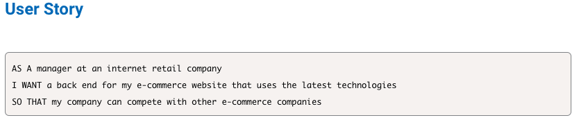
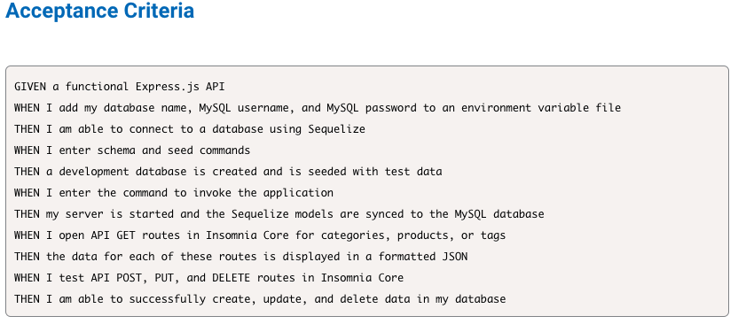

# E-commerce Back End Starter Code

# Table of Contents 
* [Description](#description) 
* [Installation](#installation)
* [License](#license)
* [Contributing](#contributing)
* [Questions](#questions)
        
## Description 
Internet retail, also known as e-commerce, is the largest sector of the electronics industry, having generated an estimated US$29 trillion in 2017 (Source: United Nations Conference on Trade and Development). E-commerce platforms like Shopify and WooCommerce provide a suite of services to businesses of all sizes. Due to the prevalence of these platforms, developers should understand the fundamental architecture of e-commerce sites.

Your challenge is to build the back end for an e-commerce site. You’ll take a working Express.js API and configure it to use Sequelize to interact with a MySQL database.

## Mock-Up

### User Story 

### Acceptance Criteria 

## Walkthrough 
<iframe src="https://drive.google.com/file/d/113iLxIckuXTRxKjZyjSsTsYcYDr0bYuw/preview" width="640" height="480"></iframe>

## Installation
to use this application one must install 
* express
* mysql2
* sequelize
* dotenv
## License 
MIT license 
## Contributing 
William Wright was sole contributer 

## Questions
if you have any questions you can reach out to me via email at wrightw404@gmail.com 